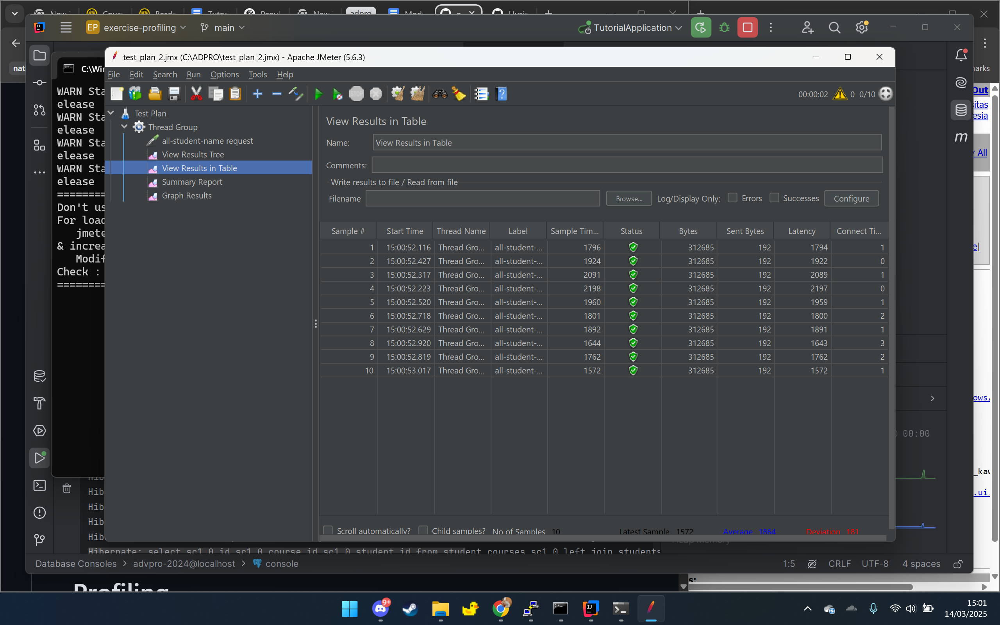
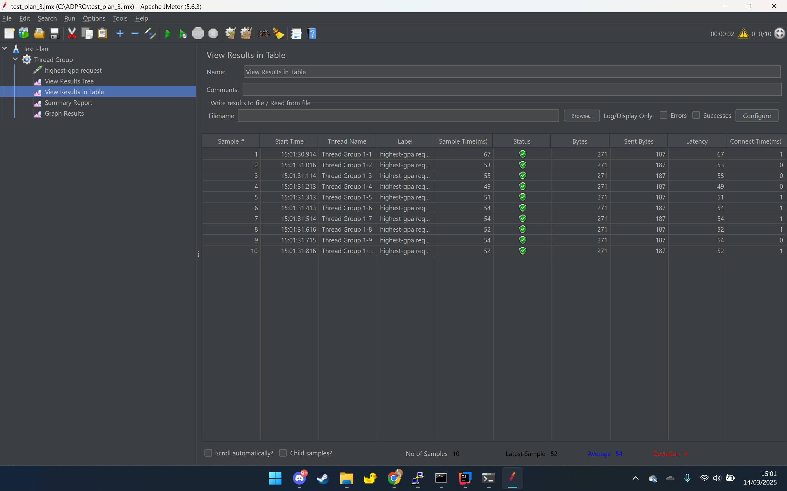
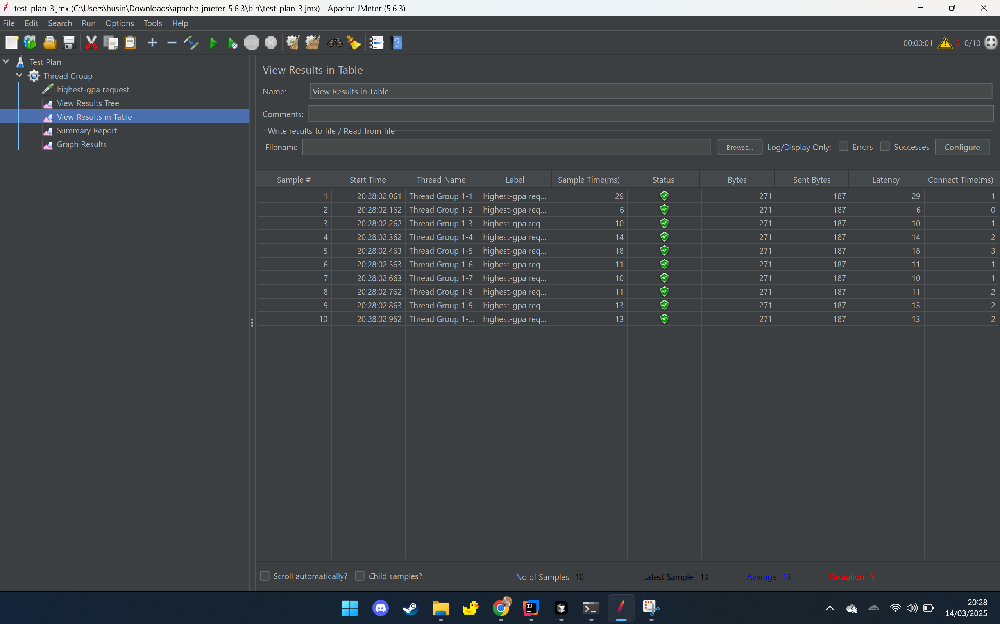

# Modul 5: Optimasi Performa

## Pendahuluan

Proyek ini berfokus pada optimasi performa aplikasi Spring Boot dengan menggunakan pengujian performa melalui JMeter dan profiling dengan IntelliJ Profiler. Tujuannya adalah untuk mengidentifikasi dan menyelesaikan bottleneck dalam aplikasi, meningkatkan waktu respons dan performa secara keseluruhan.

## Tutorial dan Latihan

### Pengujian Performa

#### Hasil Pengujian JMeter

##### Test Plan 2: /all-student-name

| Metrik | Sebelum Optimasi | Setelah Optimasi |
| ------ | ---------------- | ---------------- |
| Output Terminal |  | - |
| Hasil Pengujian |  |  |
| Laporan Ringkasan | - |  |

##### Test Plan 3: /highest-gpa

| Metrik | Sebelum Optimasi | Setelah Optimasi |
| ------ | ---------------- | ---------------- |
| Output Terminal |  | - |
| Hasil Pengujian |  |  |
| Laporan Ringkasan | - |  |

### Optimasi yang Diimplementasikan

1. **Optimasi Metode `findStudentWithHighestGpa()`**
   - Masalah: Metode ini mengambil semua data mahasiswa dan memprosesnya di Java, menyebabkan bottleneck performa.
   - Solusi: Mengimplementasikan query SQL langsung di repository untuk mengambil hanya mahasiswa dengan GPA tertinggi.
   - Implementasi:
     ```java
     @Query(value = "SELECT * FROM students WHERE gpa = (SELECT MAX(gpa) FROM students) LIMIT 1", nativeQuery = true)
     Optional<Student> findStudentWithHighestGpa();
     ```
   - Hasil: Pengurangan signifikan pada waktu respons seperti yang ditunjukkan pada hasil pengujian.

2. **Optimasi Metode `joinStudentNames()`**
   - Masalah: Metode ini menggunakan penggabungan string yang tidak efisien dalam loop.
   - Solusi: Mengimplementasikan query SQL menggunakan STRING_AGG untuk menggabungkan nama mahasiswa langsung di database.
   - Implementasi:
     ```java
     @Query("SELECT STRING_AGG(s.name, ', ') FROM Student s")
     String joinStudentNames();
     ```
   - Implementasi Alternatif (untuk kompatibilitas database):
     ```java
     public String joinStudentNames() {
         List<Student> students = studentRepository.findAll();
         StringBuilder result = new StringBuilder();
         
         for (int i = 0; i < students.size(); i++) {
             result.append(students.get(i).getName());
             if (i < students.size() - 1) {
                 result.append(", ");
             }
         }
         
         return result.toString();
     }
     ```
   - Hasil: Peningkatan waktu respons untuk endpoint all-student-name.

3. **Optimasi Metode `getAllStudentsWithCourses()`**
   - Masalah: Metode ini mengambil semua mahasiswa dan kemudian membuat query tambahan untuk setiap kursus mahasiswa.
   - Solusi: Mengimplementasikan query JOIN FETCH untuk mengambil semua relasi mahasiswa-kursus dalam satu query database.
   - Implementasi:
     ```java
     @Query("SELECT sc FROM StudentCourse sc JOIN FETCH sc.student JOIN FETCH sc.course")
     List<StudentCourse> findAllStudentsWithCourses();
     ```
   - Hasil: Mengurangi jumlah query database dan meningkatkan performa secara keseluruhan.

### Perbandingan Performa

Seperti yang ditunjukkan pada hasil pengujian, terdapat peningkatan signifikan dalam performa setelah mengimplementasikan optimasi:

1. **Untuk endpoint /highest-gpa**:
   - Waktu respons telah menurun secara signifikan seperti yang ditunjukkan pada test_plan3_after.png dan laporan ringkasan.
   - Optimasi menghilangkan kebutuhan untuk memuat semua mahasiswa ke dalam memori dan melakukan iterasi.

2. **Untuk endpoint /all-student-name**:
   - Waktu respons telah meningkat seperti yang ditunjukkan pada test_plan2_after.png dan laporan ringkasan.
   - Optimasi mengurangi overhead penggabungan string dan beban database.

Optimasi ini menunjukkan pentingnya memanfaatkan kemampuan database untuk operasi yang dapat dilakukan lebih efisien di tingkat database daripada di kode aplikasi. Dengan memindahkan logika filtering dan agregasi ke query SQL, kita telah mengurangi penggunaan CPU dan konsumsi memori dalam aplikasi kita. 